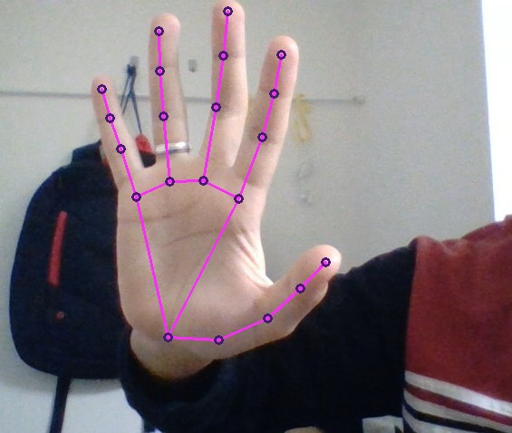

### Hand detection model.

to start with this model, you will need to install mediapipe by using your terminal:
       
       !pip install mediapipe 
       
       
 After that you will be able to run the code and get some result like the following:
 

